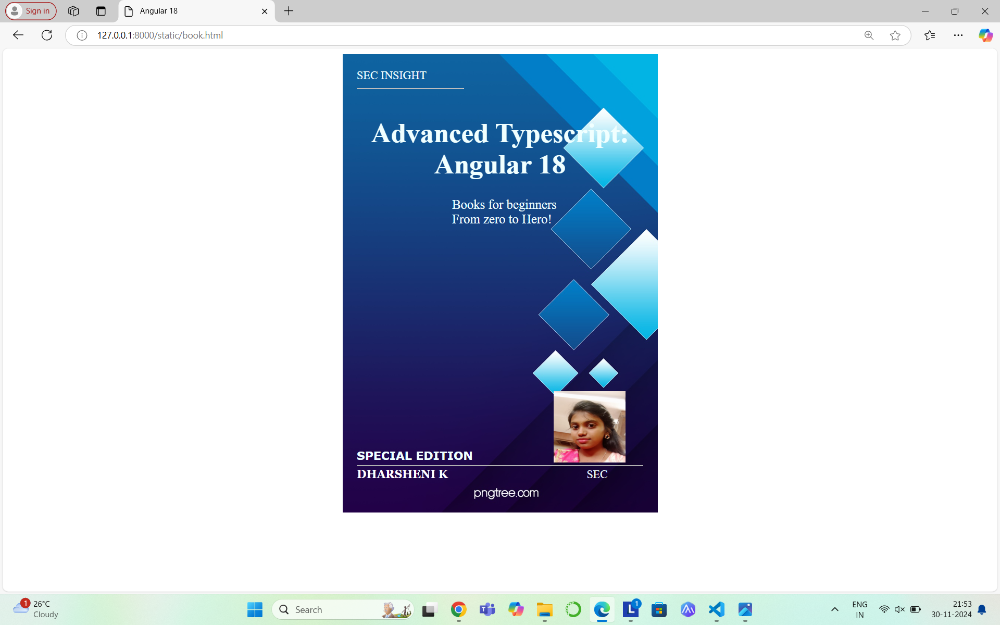

# Ex.06 Book Front Cover Page Design
## Date:28.11.24

## AIM:
To design a book front cover page using HTML and CSS.

## DESIGN STEPS:

### Step 1:
Create a Django Admin project.

### Step 2:
Create an app in the Django interface.

### Step 3:
Create a folder named 'static' in the app folder.

### Step 4:
Create a new HTML file in the static folder.

### Step 5:
Write the HTML code with relevant CSS properties.

### Step 6:
Choose the appropriate style and color scheme.

### Step 7:
Insert the images in their appropriate places.

### Step 8:
Publish the website in the LocalHost.

## PROGRAM:
```
<!DOCTYPE html>
<html>

<head>
    <title>Angular 18</title>
    <style>
        .bookpage{

            width: 400px;
            height: 600px;
            color:black;
            margin-left: auto;
            margin-right: auto;
            padding: 20px;
            font-family: ' Arial, sans-serif';
            background-image: url("cover.jpg");
            background-size: cover;
        }
            
        
        .insight{
            color:azure;
        
        }
        
        
        .hrstyle{
            width:150px;
        }
        .author{
        
            display: inline;
            position: relative;
            color:rgb(255, 255, 255);
            top:173px;
            
            font-family:Georgia;
            font-size: medium;
        }
        .booktitle{
            color:azure;
            font-family: Roquen;
            font-size: larger;
            text-align: center;
            position: relative;
            top: 30px;
        
        }
        .id {
            width:400px;
            position: relative;
            top:180px;
            
        }
        .pub{
            color:azure;
            font-size: medium;
            position: relative;
            top: 213px;
            left:308px;
        }
        .ed{
            color:azure;
            font-size: medium;
            font-family: Verdana;
            position:relative;
            top:8px;
        
        }
        .subtitle{
            color:azure;
            font-family:unicorn;
            font-size: large;
            position: relative;
            top:40px;
        }
        .mypic{
            position: relative;
            top: 183px;
            left: 260px;
            width: 90px;
            height: 80px;
            background-size:contain;
        }
        </style>
        <title>Book Cover Page</title>
        </head>
        <body>
        <div class="bookpage">
            <div class="insight">
                SEC INSIGHT
            </div>
            <div class="hrstyle">
                <hr style="color:blanchedalmond">
            </div>
            <div class="booktitle">
                <h1>Advanced Typescript: Angular 18</h1></div>
            <div class="subtitle">
                  books for beginners
            </div>
            <div class="subtitle">
                  From zero to Hero
            </div>

           
            <div class="id">
                <hr style="color:blanchedalmond">
            </div>
            <div class="author">
               <p><b>DHARSHENI K</b></p>
            </div>
            
            <div class="mypic">
                
            </div>
            <div class="pub">
                SEC
            </div>
            <div class="ed">
                <b>SPECIAL EDITION</b>
            </div>
        </div>
        </body>
        

</html>
```

## OUTPUT:




## RESULT:
The program for designing book front cover page using HTML and CSS is completed successfully.
